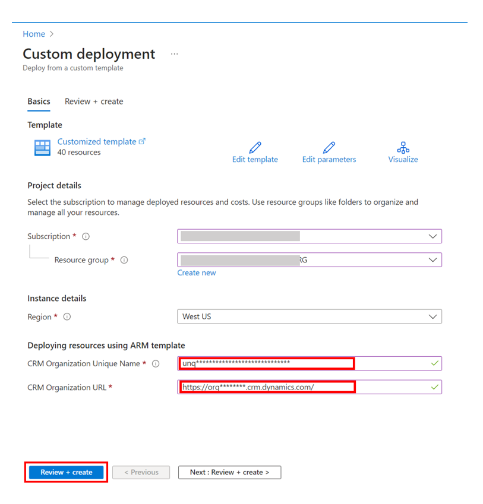

# Deploy Anomaly Detection Solution 

The ARM template will deploy all architecture components illustrated and described in [anomaly detection solution architecture and workflow description](../Docs/README.md).

## Prerequisites

Before running the ARM template, ensure the following prerequisites are met:

- [Dynamics 365 Field Service is installed](https://learn.microsoft.com/en-us/dynamics365/field-service/install-field-service).
- System Administrator and IoT-Administrator security roles are set up.
- Active [Azure subscription with privileges to create resources and services](https://learn.microsoft.com/en-us/dynamics365/field-service/cfs-azure-subscription).

## Deploy to Azure using the ARM template

By deploying this template, you confirm that you’ve read and agree to the [Terms of Service](../../Terms_of_Service.md) and the [Microsoft Privacy Statement](https://privacy.microsoft.com/en-us/privacystatement).

A screen similar to below will be presented to you. Fill in the information as instructed following this diagram. 

1. Choose an existing Azure subscription. Choose a resource group or create one in the selected subscription. 
2. Set the region to the same region as your Dynamics 365 Field Service environment.
3. Enter the [unique name of your organization]([Find your environment and organization ID and name - Power Platform | Microsoft Learn](https://learn.microsoft.com/en-us/power-platform/admin/determine-org-id-name#find-your-organization-name)), and the Dynamics 365 URL of your Field Service environment (format: https://org********.crm.dynamics.com/)
4. Review and create the resources from the template.
5. Before proceeding to setting up the solution, ensure the deployment is complete and error free. 

# Set up Anomaly Detection Solution 

After you have deployed the solution without errors, you can proceed to set up the solution in two steps:

1. [Set Up Connected Field Service Instructions](../Docs/Connected_Field_Service/Preserved-Installation-Setup-IoTHub.md) to set up connected field services. 
2. [Set Up Anomaly Detection Instructions](../Docs/Setup-Anomaly-Detection-Solution.md) to set up anomaly detection solution.
