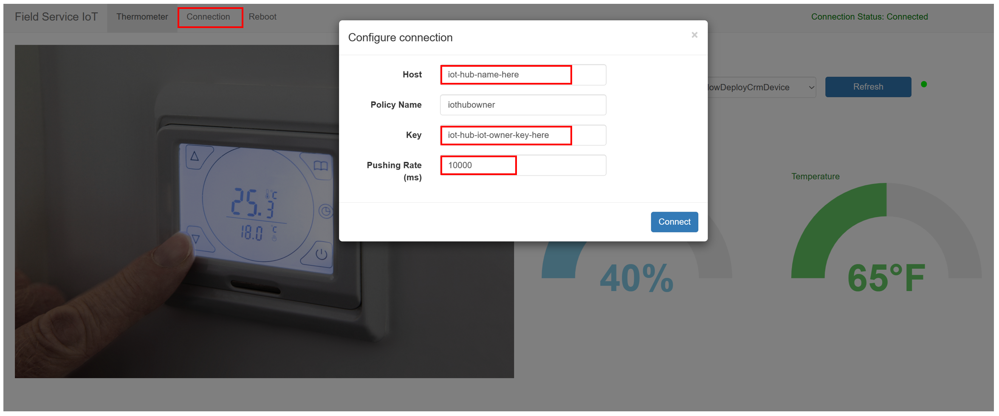

# Installation and setup - Connected Field Service for Azure IoT Hub

This guide provides all the steps required for setting up and running with Connected Field Service (CFS) for IoT Hub.

## Prerequisites

 Ensure the following before configuring Connected Field Service.

- Dynamics 365 Field Service is installed ([Install Dynamics 365 Field Service - Dynamics 365 Field Service | Microsoft Learn](https://learn.microsoft.com/en-us/dynamics365/field-service/install-field-service)).
  
- System Administrator and IoT-Administrator security roles are set up.

- Active Azure subscription with privileges to create resources and service ([Microsoft Azure subscription prerequisites for Connected Field Service with IoT Hub - Dynamics 365 Field Service | Microsoft Learn](https://learn.microsoft.com/en-us/dynamics365/field-service/cfs-azure-subscription)).

- (*Skip this step, as it is not needed for anomaly detection solution accelerator*) For Azure Time Series Insights, create an app registration ([Quickstart: Register an app in the Microsoft identity platform - Microsoft Entra | Microsoft Learn](https://learn.microsoft.com/en-us/azure/active-directory/develop/quickstart-register-app)) in the Azure portal. Take note of the Application (client) ID and the Object ID. Add a client secret ([Quickstart: Register an app in the Microsoft identity platform - Microsoft Entra | Microsoft Learn](https://learn.microsoft.com/en-us/azure/active-directory/develop/quickstart-register-app#add-a-client-secret)), and record the client secret value. You'll need these values multiple times during the installation.

## Step 1: Deploy Connected Field Service and Azure resources from an ARM template (`Implicitly Completed`)

*Skip this step. You have already completed this step if you have deployed the resources following the instructions here:* [ARM Template Deployment Guide for Anomaly Detection Solution](../../Deployment/Deploy-Anomaly-Detection-Solution.md).

## Step 2: Create new IoT Provider Instance

1. Sign into your Dynamics 365 organization and open the Connected Field Service app module.

1. In Connected Field Service, go to the **Settings** area.

1. Select **Providers** and select **New**.

1. On the **New IoT Provider Instance** page, fill out the fields:

   

   - **Name**: Enter the name of the resource group in Azure where you deployed IoT resources.
   - **IoT Provider**: [Choose or create the IoT provider for IoT Hub]([Create IoT Provider for Azure IoT Hub - Dynamics 365 Field Service | Microsoft Learn](https://learn.microsoft.com/en-us/dynamics365/field-service/cfs-provider-iot-hub)).
   - **Provider Instance Id**: Enter the name of the IoT Hub resource that was deployed to your resource group in Azure.
   - **URL**: Enter the URL of the overview for the resource group in the Azure portal. Example: `https://portal.azure.com/[tenant_id]/subscriptions/[subscription_id]/resourceGroups/[resource_group_name]/overview`.
   
1. Select **Save** to create the new IoT Provider Instance record.

1. We now need to update the IoT Provider Settings for the newly created provider instance. In the **Settings** area, select **IoT Settings** > **IoT Provider Settings**.

   

   

1. For **Default IoT Provider**, set the **Instance** to the IoT Provider Instance you created previously.

1. Select **Save & Close** to save your changes.

## Step 3: Set up IoT endpoint

1. Download the [Power Platform CLI](https://aka.ms/PowerAppsCLI) and install it.
1. Open the CLI and launch the [Plugin Registration Tool (PRT)]([Microsoft Power Platform CLI tool command group - Power Platform | Microsoft Learn](https://learn.microsoft.com/en-us/power-platform/developer/cli/reference/tool#pac-tool-prt)) with the command `pac tool prt`.
1. In the PRT window, select **Create New Connection**. You will be shown a **Login** Screen. Select **Office 365**, Check **Display list of available organizations**. And check **Show Advanced**. Select the region of your Field Service environment, enter your Field Service credentials and click **Login**.
1. If you are a user of multiple Dynamics 365 organizations, you will be presented another screen allowing you to choose one **Organization Name**, from a list. Choose  the one you intended to work with. Then click **Login**. 
1. Once connected to the organization, find the **IoT Message** Service Endpoint and select it. 
1. Select **Update**.
1. For **NameSpace Address**, find the hostname for the [Service Bus Namespace]([Use Azure Service Bus Explorer to run data operations - Azure Service Bus | Microsoft Learn](https://learn.microsoft.com/en-us/azure/service-bus-messaging/explorer#use-the-service-bus-explorer)) deployed to your resource group. Enter the hostname in the Plug-in Registration Tool, prefixed by `sb://`. Example: `sb://myServiceBusNamespace.servicebus.windows.net`
1. In the Service Bus Namespace resource, go to **Queues** and find the queue with a name ending in `-crm`. Copy the full name and enter it as the **Topic Name** in the Plug-in Registration Tool.
1. For **Message Format**, choose *XML*.
1. In the Service Bus Namespace resource, go to **Shared access policies** > **RootManageSharedAccessKey**.
   - Copy the name and paste it for SAS Key Name.
   - Copy the [primary key]([Use the Azure portal to create Service Bus topics and subscriptions - Azure Service Bus | Microsoft Learn](https://learn.microsoft.com/en-us/azure/service-bus-messaging/service-bus-quickstart-topics-subscriptions-portal)) and paste it into the Plug-in Registration Tool for **SAS Key**.
1. Select **Save**.  
    

## Step 4: Authorize Azure app connection

Connect the Azure IoTHub to your Field Service environment.

1. Sign into your Azure account, and then go to the [Azure portal](https://portal.azure.com).

1. On the Azure portal, go to **Resource Groups** and find the resource group you recently deployed IoT Hub to.

1. Select the *API Connection* resource **commondataservice**.

1. On left pane, under **General**, select **Edit API Connection**, and then select **Authorize**. Sign in with your Dynamics 365 credentials that you use to sign into your Connected Field Service environment. They may be different than your Azure credentials to the Azure portal. Select **Save** to apply your changes.

## Step 5: Update devicerules.json

The Stream Analytics job deployed to your resource group will have a reference to a `devicerules.json` file. This file defines a rule that is used to create IoT Alerts when using the optional device simulator. To use the rule, upload the `devicerules.json` file and reproduce the directory structure. The exact structure is needed for the sample alert to work.

1. Download the `devicerules.json` file from the [this link](../../Deployment/Data/devicerules.json). 

1. Open the resource group in the Azure admin portal and select the storage account `storage*********` deployed to your resource group. Select **Containers** and create a container called `devicerules`.

1. Open the newly created storage container `devicerules` and select **Upload**. Select **Browse for files** and select `devicerules.json`. Expand the Advanced section, enter *2016-05-30* in the **Upload to folder** field, then select **Upload**.

1. Open the newly created folder `2016-05-30` and select **Upload**. Select **Browse for files** and select `devicerules.json`. Expand the Advanced section, enter *22-40* in the **Upload to folder** field, then select **Upload**.

## Step 6: Start Azure Stream Analytics job

1. Sign into your Azure account, and then go to the [Azure portal](https://portal.azure.com).

1. On the Azure portal, go to **Resource Groups** and find the resource group you recently deployed IoT Hub to.

1. Select each Stream Analytics job that was deployed and, from the **Overview** tab, select **Start**.

Congratulations! You're now ready to pass data between Azure IoT Hub and Dynamics 365 to use Connected Field Service.

## Step 7: Update Azure Time Series Insights connection (Optional)

*Skip this step as it is not needed for the Anomaly Detection Solution*. 

## Step 8: Set up the simulator 

The simulator lets you test Connected Field Service without the need to connect physical hardware. Simulated IoT devices and data help you understand different parts that contribute to turning IoT data into work orders.

Set up the simulator to simulate IoT devices and data and begin to see device data pulled into Field Service.

To find the simulator URL, sign in to your Azure subscription, and then select the App Service resource type that starts with "Simulator" under the newly created resource group. You’ll see the URL is in the top-right corner. Copy the URL and complete the following steps:  

1. Paste the URL into your browser’s address bar to load the page.  

1. When the simulator page opens, select **Connection**.  

1. Enter the IoT hub host name and key. The host is the host name of the IoT Hub resource in the Azure admin portal.

1. The simulator sends device telemetry messages (humidity and temperature) at an interval.  The default interval is 10,000 milliseconds (10 seconds).  You can change this value of the interval to send telemetry by filling in your own pushing rate. 

   

   Get the access key by selecting the IoT Hub resource and opening the shared access policies. Copy the primary key for *iothubowner*.

   

1. Select the IoT hub in the **Resource Group**.  

1. On the left under **General**, select **Shared access policies** to get the host name and primary key.  

1. Make sure **Connection status**  is marked as **Connected** and then close the dialog box.  

Now you can send a test command by using the sample simulator. For example, select the temperature and increase it to above 70 degrees. The simulator is preprogrammed to create an IoT alert if temperature is above 70 degrees.

## Next steps

- [Register devices](https://learn.microsoft.com/en-us/dynamics365/field-service/cfs-register-devices)
- [Pull Device Data](https://learn.microsoft.com/en-us/dynamics365/field-service/cfs-pull-device-data)
- [Visualize device readings](https://learn.microsoft.com/en-us/dynamics365/field-service/cfs-visualizations-iot-hub)
- [Send commands in Connected Field Service](https://learn.microsoft.com/en-us/dynamics365/field-service/cfs-commands)
- [Send Command Simulation](./Send-Command-Simulation.md) 

## Privacy notice

By installing Connected Field Service for Dynamics 365, when you provide your Azure subscription information, the required Azure resources (listed below) will be deployed and your Dynamics 365 for Customer Engagement instance will send data (such as commands and registrations) to Azure to enable IoT–enabled scenarios that register devices and then send and receive commands to the registered devices. An administrator can uninstall Connected Field Service to remove the functionality and then navigate to the Azure portal to manage any related Azure services that are no longer needed.

**Note:** For more information about additional Azure service offerings, see the [Microsoft Azure Trust Center](https://azure.microsoft.com/support/trust-center/).

Azure components and services that are involved with Connected Field Service functionality are detailed in the following sections.

[Service bus queue](https://learn.microsoft.com/en-us/azure/service-bus-messaging/service-bus-dotnet-get-started-with-queues)

This provides a queue for both inbound and outbound messages (commands) flowing between Dynamics 365 for Customer Engagement and Azure. When an IoT alert is sent to Dynamics 365 for Customer Engagement, or a command is sent from Dynamics 365 for Customer Engagement to the IoT hub, it will be queued here.

[Logic Apps](https://azure.microsoft.com/services/logic-apps/)

This provides an orchestration service that uses a Dynamics 365 for Customer Engagement connector and a Queue connector. Dynamics 365 for Customer Engagement connectors are used to construct entities that are specific to Dynamics 365 for Customer Engagementand Queue connectors are used for polling the queue.

[Stream analytics](https://azure.microsoft.com/services/stream-analytics/)

This provides a fully managed, real-time event processing engine that helps to unlock deep insights from data. Stream Analytics makes it easy to set up real-time analytic computations on data streaming from devices, sensors, web sites, social media, applications, infrastructure systems, and more. It is functioning as a funnel to send selective IoT alerts to Dynamics 365 for Customer Engagement.

[IoT Hub](https://azure.microsoft.com/services/iot-hub/)

Connected Field Services uses the IoT Hub to manage the state of registered devices and assets. In addition, the IoT Hub sends commands and notifications to connected devices—and tracks message delivery with acknowledgement receipts. Device messages are sent in a durable way to accommodate intermittently connected devices.

**Simulator**

This is a test web app to emulate the device that is sending commands or receiving commands from the IoT hub.

[Azure SQL Database](https://azure.microsoft.com/services/sql-database/)

Connected Field Service uses SQL Azure to store device heartbeat messages for later use by PowerBI to show the status of devices in Dynamics 365 for Customer Engagement.

[Azure Blob Storage](https://azure.microsoft.com/services/storage/)

Queries that Stream Analytics will use are stored to Azure Blob storage.

[Azure Time Series Insights](https://learn.microsoft.com/en-us/azure/time-series-insights/)

[Connected Field Service Device Readings](https://learn.microsoft.com/en-us/dynamics365/field-service/cfs-visualizations-iot-hub) uses Azure Time Series Insight to store, process, and query IoT devices measurements from IoT Hub.

