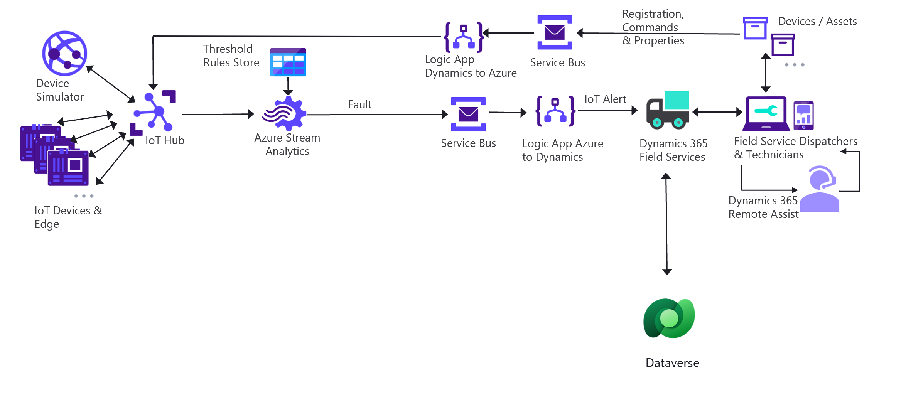

# Important Notice 

**Courtesy of the source code and documentation from Dynamics 365 Connected Field Services (CFS)  - Azure IoT Hub**: [CFS GitHub Repo](https://github.com/microsoft/Dynamics-365-Connected-Field-Service-Deployment) and  [Installation and setup - Connected Field Service for Azure IoT Hub](https://docs.microsoft.com/dynamics365/field-service/installation-setup-iothub), our IFS anomaly detection solution accelerator code was forked from the published code in March 2023. In order to keep the code and instructions in synchronization,  a snapshot of the CFS set up documentation was taken in March 2023. The documentation snapshot is preserved as the [Preserved CFS Installation and Set Up Guide](./Preserved-Installation-Setup-IoTHub.md).

As a reference, this page provides additional background information about the architecture delivered by the [CFS GitHub Repo](https://github.com/microsoft/Dynamics-365-Connected-Field-Service-Deployment).

If you had deployed the code from this [CFS GitHub Repo](https://github.com/microsoft/Dynamics-365-Connected-Field-Service-Deployment) and followed the [Instructions for installation and setup - Connected Field Service for Azure IoT Hub](https://docs.microsoft.com/dynamics365/field-service/installation-setup-iothub), you would have set up the architecture for the Connected Field Service - Azure IoT Hub, as illustrated below. 

The workflow of the above architecture can be summarized as below:

#### Device Registration, Commands, and Properties  

Work flow from Dynamics 365 to IoT Hub:

- When you  **Register** an IoT Device in Dynamics 365 Field Service, the registration information is delivered to the service bus, which triggers the `Logic App Dynamics to Azure`. The logic app updates the device information in `Dataverse`, and delivers the request to the IoT Hub. The IoT device is now registered with the IoT Hub. 
- When you send a **Command** to a specified IoT device, such as a reset command, the command is delivered to the service bus, which triggers the `Logic App Dynamics to Azure`. The logic app updates the command information in `Dataverse`.  This information is received by  the IoT Hub. The IoT Hub delivers the command to the IoT Device. The IoT Device takes appropriate actions.  
- When you retrieve property information for a specified IoT device, such as device status, last activity time, the request is delivered to the service bus, which triggers the `Logic App Dynamics to Azure`. The logic app creates a device data record in `Dataverse`. The  information is received by  Dynamics 365 field service. 

#### Receiving IoT Alerts

Work flow from IoT Hub to Dynamics 365: 

From the IoT Hub, the IoT sensor data is passed to `Azure Stream Analytics`. when an IoT device sensor data is outside the ranges specified by the device rules stored in the `Threshold Rules Store`, an **IoT Alert** or **Fault** message is delivered to the service bus, which triggers the `Logic App Azure to Dynamics`. The logic app creates a new IoT Alert record in `Dataverse`. This message is picked up by Dynamics 365.  

Dynamics 365 field services can be configured to process **IoT Alert** messages based on set criteria and create work orders pragmatically based on specified rules. 

