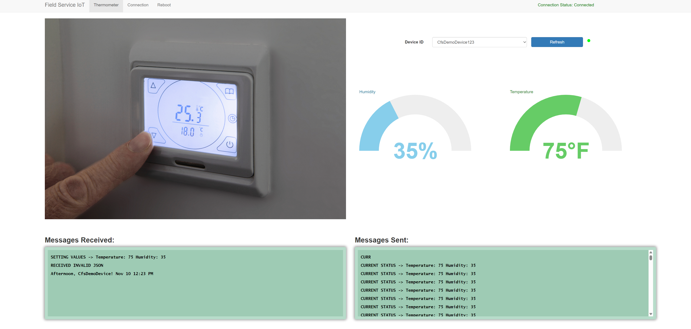

# Send Notification or Command to an IoT Device  

The IoT device must be registered first before you can send notifications and commands to it. 

To test, in D365 field service, create a new IoT device and name it as "`CfsDemoIoTDevice123`" or any name of your choice. Click **Register**.  For more information, please refer to [Register IoT devices in Dynamics 365 Field Service (contains video) | Microsoft Learn](https://learn.microsoft.com/en-us/dynamics365/field-service/cfs-register-devices).

You can now create an IoT command from Dynamics 365 Field Service and send the command to the IoT device. For more information, please refer to [Register and manage devices with Connected Field Service for Dynamics 365 and Azure IoT - Training | Microsoft Learn.](https://learn.microsoft.com/en-us/training/modules/register-and-manage-customer-devices-with-connected-field-service/)

## Send  Message to IOT Device

From connected field service, left panel, under **Connected Devices**, click **Commands**.

Type below command inside the Message Box. `{"CommandName":"Notification","Parameters":{"Message":"Afternoon, CfsDemoDevice! Nov 10 12:23 PM"}}`. Press **Send Command** on the menu bar, as illustrated below. 

## Send Reset Value Command to IoT Device 

You can create a command that resets the values of the IoT device. Type below command inside the Message Box. `{"CommandName":"Set Values","Parameters":{"Reading":{"Temperature":"75","Humidity":"35"}}}`. Press **Send Command**, as illustrated below. 

## Observe Results of the IoT Commands in the Simulator  

Below is a simulator screen shot that illustrates the commands received by the specified IoT device “`CfsDemoDevice123`”. Now the thermostat's temperature is set to 75 and humidity to 35. If you happen to send a command that is not in the right format, the simulator will display "RECEIVED INVALID JSON", as illustrated below.

