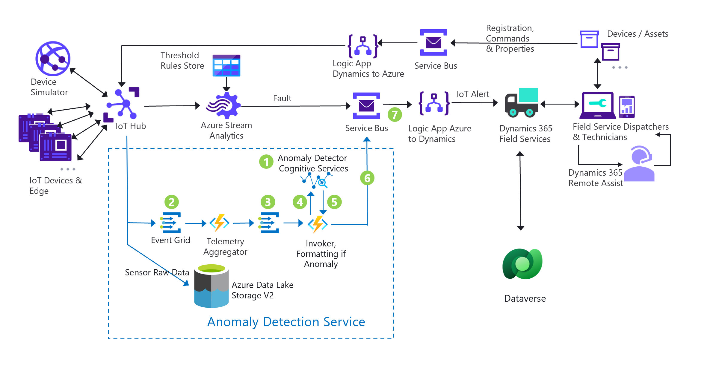

# IFS Anomaly Detection Solution Overview

IFS Anomaly Detection solution detects unusual patterns or anomalies in IoT telemetry data in real time. It collects IoT telemetry data and invokes API Services provided by the [Anomaly Detector](https://learn.microsoft.com/en-us/azure/cognitive-services/anomaly-detector/overview). The Anomaly Detector uses machine learning algorithms to analyze time-series data, such as IoT telemetry, logs, and business metrics, and identify anomalies based on historical patterns and trends. Anomaly Detector also provides a confidence score to help assess the severity of the anomaly, enabling field service providers to take appropriate actions. 

To test the anomaly detection solution, we created a machine learning model using [sample IoT sensor data](../Deployment/Data/sensordata.csv). The machine learning model ID is plugged into an Azure Functions App called `Invoker` that interacts with the Anomaly Detector. The model can be updated with newer data when necessary. When an anomaly is detected, the `Invoker` sends message to Dynamics 365 Field service with confidence score, severity, along with actual IoT telemetry data so that appropriate action can be taken based on this message. How the action is taken can be programmed in Dynamics 365. 

# IFS Anomaly Detection Solution Architecture 

Below architecture diagram illustrates the main components and information flow of this solution accelerator.

# Architecture Workflow

The workflow corresponding to the anomaly detection solution noted in the Architecture Diagram is as follows: 

1. Sample IoT sensor data is used to create an AI model using [Anomaly Detector](https://learn.microsoft.com/en-us/azure/cognitive-services/anomaly-detector/). This is done through a console app supplied by this solution accelerator. Refer to [the visual studio set up instructions](./Setup-Anomaly-Detection-Solution.md)  or [the visual studio code set up instructions](./VSCode-Instructions.md) on how to train an AI model and plug the model into the solution. This needs to be performed only once or as needed with new data set to improve the AI model. Only one model is set to be active and utilized by the solution. 
2. The telemetry data is received from the IoT Hub via Event Grid. The event is subscribed by the Functions App called `Telemetry Aggregator`. The Functions App accumulates and aggerates a series of IoT sensor data. 
3. The Telemetry Aggregator sends the aggregated data to the second Event Grid. The event is subscribed by the Azure Functions App referred as the `Invoker`. 
4. The `Invoker` sends the aggregated data to the `Anomaly Detector Cognitive Services`. 
5. The Anomaly Detector Cognitive Services analyzes the telemetry data and determines if the data falls within the expected range of values for that particular device, and send back response to the `Invoker` accordingly. 
6. If the data falls outside of that range, The `Invoker` formats the response and sends the message to the `Service Bus`. 
7. The `Service bus` will delivery this event to the Dynamics 365 via the component `Logic App Azure to Dynamics`.  
