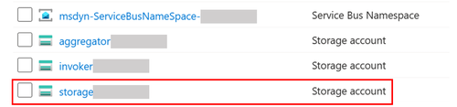
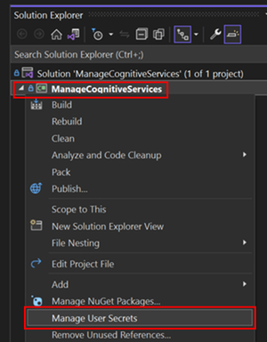
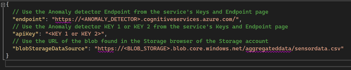
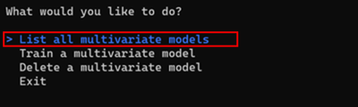
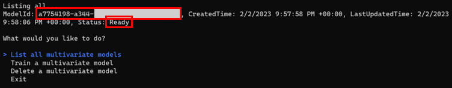
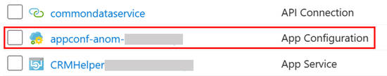
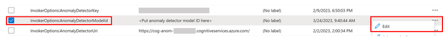
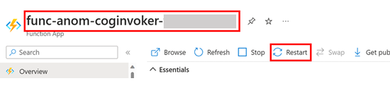

# Set up Multivariate Anomaly Detection
After following the [deployment instructions](../Deployment/Deploy-Anomaly-Detection-Solution.md) and setting up the connected field service using the provided [setup CFS instructions](./Connected_Field_Service/Preserved-Installation-Setup-IoTHub.md), follow the steps below to configure the anomaly detection component of the solution.

## Step 1: Upload the historical sensor data
A multivariate anomaly detection model needs to be trained from historical device data.
The `sensordata.csv` file contains a sample historical data set for the thermostat simulator application.
This data is uploaded to [Azure Blob Storage](https://azure.microsoft.com/en-us/products/storage/blobs) and the [Anomaly Detector](https://azure.microsoft.com/en-us/products/cognitive-services/anomaly-detector) Cognitive Services accesses this file during model training.

1. Download the `sensordata.csv` file from the [repo](../Deployment/Data/sensordata.csv).
1. Open the resource group in the [Azure admin portal](https://portal.azure.com) and select the Storage account resource  `storage*************` deployed to your resource group.  

1. Select **Containers** and create a container called `aggregateddata`.
1. Open the newly created storage container `aggregateddata` and select **Upload**. Select **Browse for files** and select `sensordata.csv`. Select **Upload**.

## Step 2: Train the model
Interactions with the Anomaly Detector Cognitive Service are done using APIs.
A console application has been provided to interact with Cognitive Services in Azure.
The following steps are for Visual Studio.
Alternatively the console application can be run [Using Visual Studio Code](./VSCode-Instructions.md).

### Using Visual Studio
1. Open the [IFS.AD.sln](../Code/IFS.AD) in Visual Studio. 
1. In the **Solution Explorer**, right click the `IFS.AD.ConsoleApps.ManageCognitiveServices` project and choose **Manage User Secrets**. A `secrets.json` file will open.   
       
1. Add the `endpoint`, `apiKey`, and `blobStorageDataSource` JSON properties with values taken from your subscription to the `secrets.json` file. To find the `endpoint` and `apikey`, go to the **Anomaly detector** resource overview page,  at left pane, under **Resource Management**, click **Keys and Endpoint**. You will be presented a page where you can copy and paste the value of the `endpoint` and `apikey` to the `secrets.json` file.  To configure `blobStorageDataSource`, go to the storage account  `storage*************`, copy the account name, and replace `<BLOB_STRAGE>` with the account name.   
       
1. In the **Solution Explorer**, press F5 or press the green play button to run the console app. Choose **"List all multivariate models"**. You will  not see any models listed.  
       
1. In the console application, choose **"Train a multivariate model"** to create a new model. The model will be asynchronously trained inside the Anomaly Detector service.   
1. In the console application, choose **"List all multivariate models"** to see a model with **"Status: Ready"**. If the model status is not "Ready", keep checking until it is. Sometimes this can take a few minutes.   
1. Copy the **ModelId GUID** from the console application output.  
       
## Step 3: Configure and Restart the Invoker Function App
Now that a GUID for the model has been generated and it has completed training, the `Invoker Function App` needs to know the ModelId GUID value.
It will use this information to assess if an anomaly had occurred.

1. Open the resource group in the [Azure admin portal](https://portal.azure.com) and select the App Configuration service  `appconf-anom-*************` deployed to your resource group.  
    
1. Select **Configuration explorer** from the **Operations** section in the left pane.
1. Select and **Edit** the `InvokerOptions:AnomalyDetectorModelId` key.  
       
1. Set the **Value** text box to the ModelId GUID copied from the console application. Select **Apply**.
1. Open the resource group in the [Azure admin portal](https://portal.azure.com) and select the Function App service `func-anom-coginvoker-*************`  deployed to your resource group.  Select **Restart**.  
       