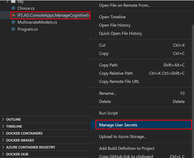

# Step 2: Train the model
## Prerequisite
1. Install [Manage User Secrets](https://marketplace.visualstudio.com/items?itemName=Reptarsrage.vscode-manage-user-secrets)
1. Install [.NET Extenstion Package](https://code.visualstudio.com/docs/languages/dotnet)
1. Install [.NET SDK Runtime](https://dotnet.microsoft.com/en-us/download)

## Using Visual Studio Code
1. Open the `Deployment/Code/IFS.AD/IFS.AD.ConsoleApps.ManageCognitiveServices` folder in Visual Studio Code.
1. In the **Explorer**, right click the `IFS.AD.ConsoleApps.ManageCognitiveServices.csproj` file and choose **Manage User Secrets**. A `secrets.json` file will open.  

1. Add the `endpoint`, `apiKey`, and `blobStorageDataSource` JSON properties with values taken from your subscription to the `secrets.json` file.  

1. Open the **Terminal** and in the `IFS.AD.ConsoleApps.ManageCognitiveServices` folder execute the `dotnet run` command.
1. In the console application, choose **"Train a multivariate model"** to create a new model. The model will be asynchronously trained inside the Anomaly Detector service.
1. In the console application, choose **"List all multivariate models"** to see a model with **"Status: Ready"**. If the model status is not "Ready", keep checking until it is. Sometimes this can take a few minutes.
1. Copy the **ModelId GUID** from the console application output.  
