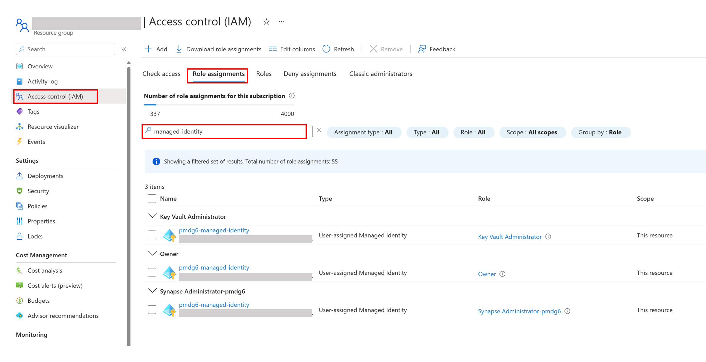
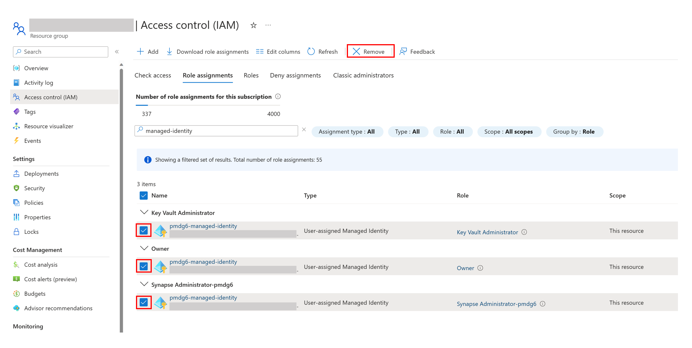
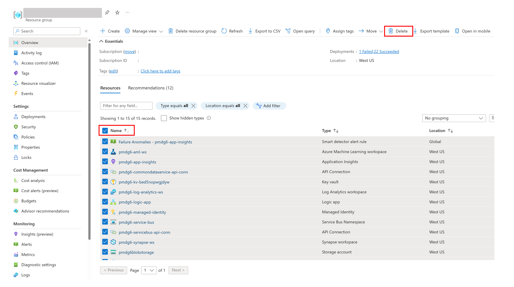
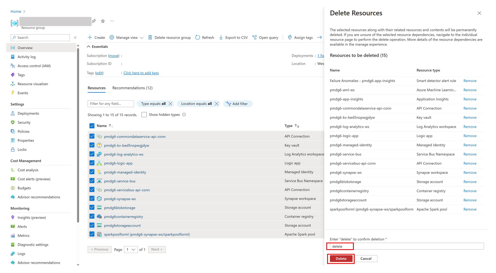

# Deployment Clean Up

If you no longer need the resources you have created during the deployment process, you can delete them. Follow this guide to clean up the resources. 

### Remove the Resource Group 

If the resource group contains only the resources you need to remove, you can remove the resource group. This will result all resources contained within are removed as well. Otherwise, follow below steps to remove resources,. 

### Remove Managed Identity Assignment

 You will remove the managed identity role assignments before removing the rest of the resources. 

1. From the overview page of the resource group, left navigation pane, click `Access control (IAM)`. Click `Role assignments` tab, and then search for `'prefix'-managed-identity`. 

2. Select the resources to be removed, and Click `Remove`. You will be asked for confirmation. click on `yes` to confirm.

   

### Remove Rest of the Resources 

To remove the rese of the resources, follow below steps. 

1. Go to the overview page of the resource group, select all resources you wanted to delete, and click `Delete` .

   

2. After you have clicked `Delete`, you will be asked for confirmation. Enter 'delete' keyword in the text box and click `Delete`. Make sure to check if you are deleting resources only from the resource group you desired to clean up.

   
