# Predictive Maintenance Deployment Guide
The deployment must be successful and error free before starting set up the solution. After successful deployment, please follow below steps to set up the solution accelerator.

You have two options to setup the solution:

**Option 1 - Use sample data provided.**

**Option 2 - Connect to Dataverse data from Dynamic 365 Field Services.**

## Set up Dataverse API Connection (Skip this if you are using option 1)

1. https://portal.azure.com, find the resource group where the resources are deployed.  Search for the Dataverse API resource named as `prefix-commondataservice-api-conn`. '`prefix`' is what you typed in when you deployed the solution. 

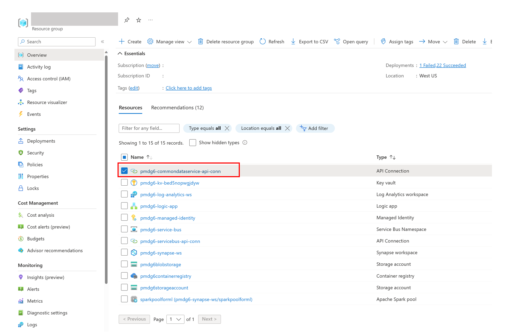

2. Open the connection and click on "`Edit API connection`" on left pane. Then click "`Authorize`". This will open authorization window. The authorize window will ask you to pick up an account. Choose the account associated with the Dataverse. If your signed in account associated with D365 environment then select the signed in account. 

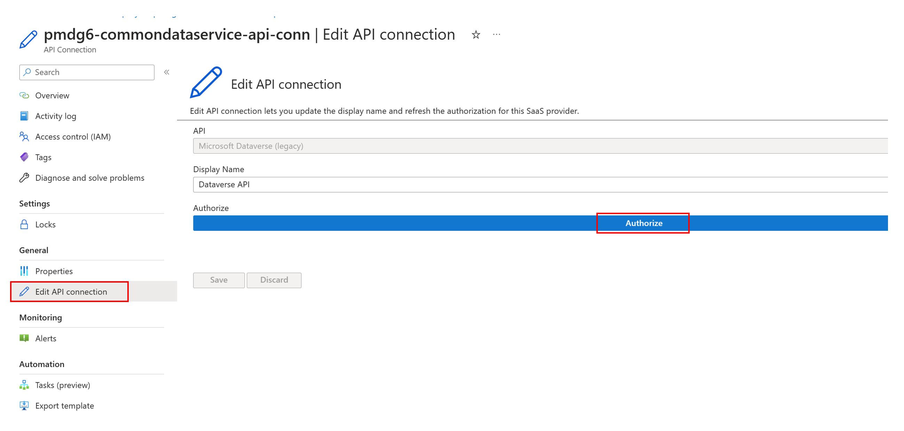

3. Once successful click `save` and go back to the root of resource group.

## Access configuration

The user who sets up the solution needs to have below security privileges: 

- Synapse workspace administrator
- Key Vault Administrator 
- Storage Blob Data Contributor 

Follow steps outlined below to assign roles to the user. 

### Synapse Workspace Administrator Role

Add the user account as synapse workspace administrator. For more details please follow this guide : [How to manage Synapse RBAC role assignments in Synapse Studio](https://learn.microsoft.com/en-us/azure/synapse-analytics/security/how-to-manage-synapse-rbac-role-assignments).

### Key Vault Administrator Role

Add key vault administrator role to the same user account. Please follow below steps:

1. Open the Key Vault resource from resource group page, and select the key vault resource. It will have the name `prefix-kv-kv-bed5nopwgjdyw`, as illustrated below. 

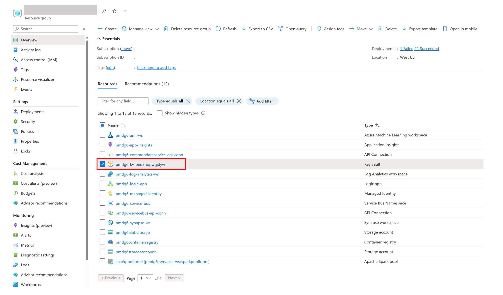

2. Click `Access Control (IAM)` from left pane, then click `Add` and Select `Add role assignment.`, refer to the picture below. 

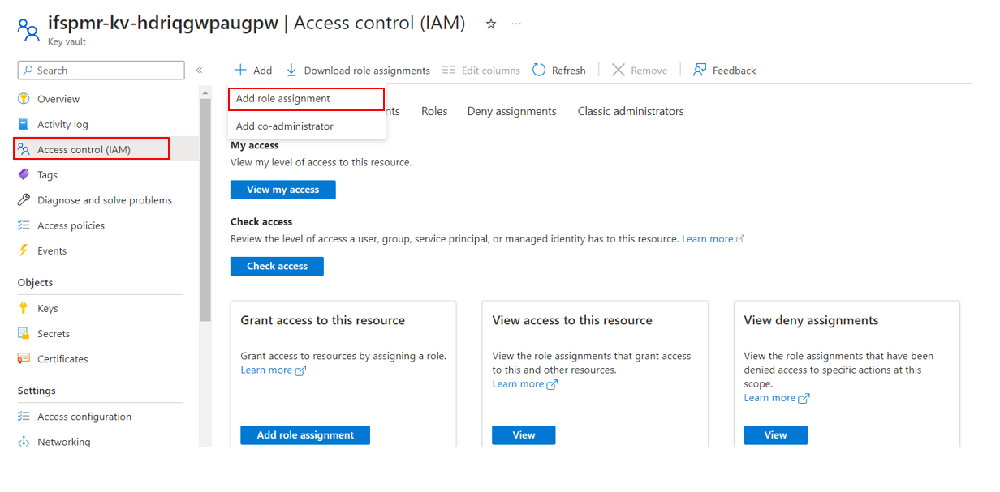

3. Select `Key Vault Administrator` and click `Next`. 

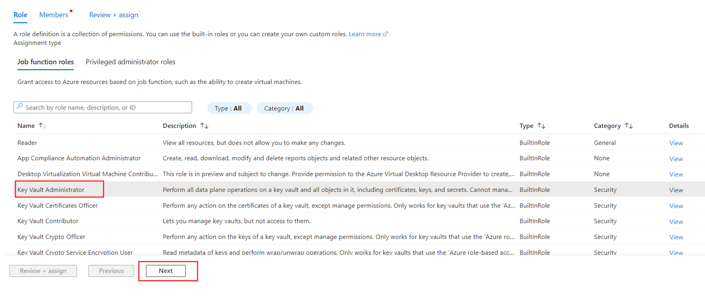

4. Set `Assign access to` option to `User, group, or service principal`.  Click `+Select members`. This will open another window with a list of candidate names, with option to "Search by name or email address". Once the user is found and information displayed, click the user, and then click `Select`. 

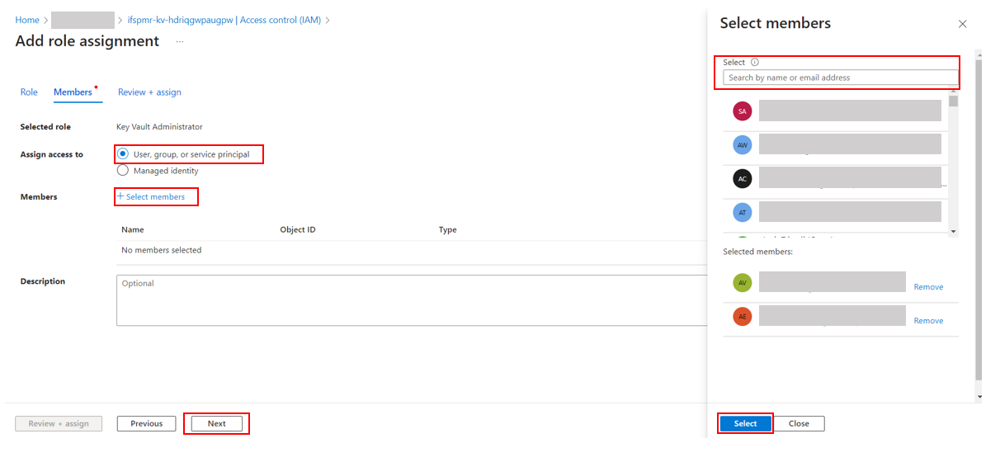

5. Click `Review + assign` to complete the process.

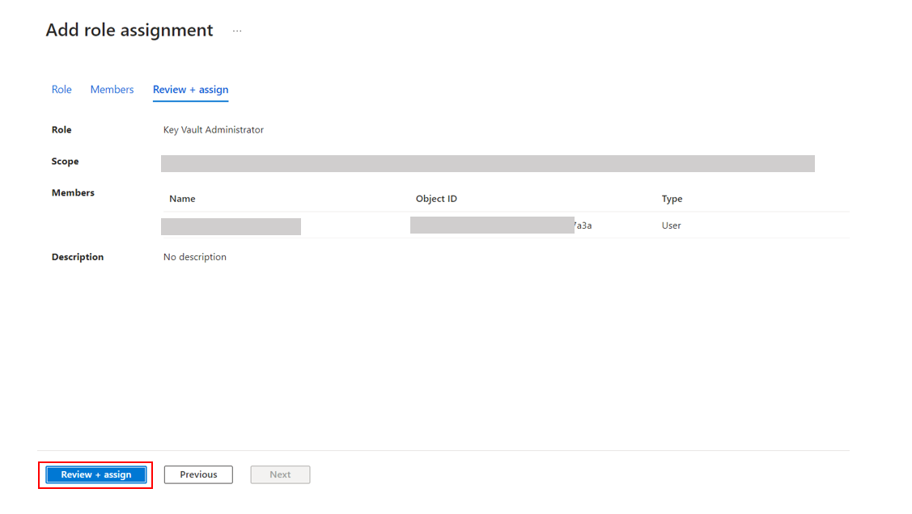

### Storage Blob Data Contributor

Add storage blob data contributor to the data lake storage associated with synapse workspace for the same accounts, please follow below steps:
1. Open the storage account resource from resource group root page. Find the storage account by the name `'prefix'storageaccount`.

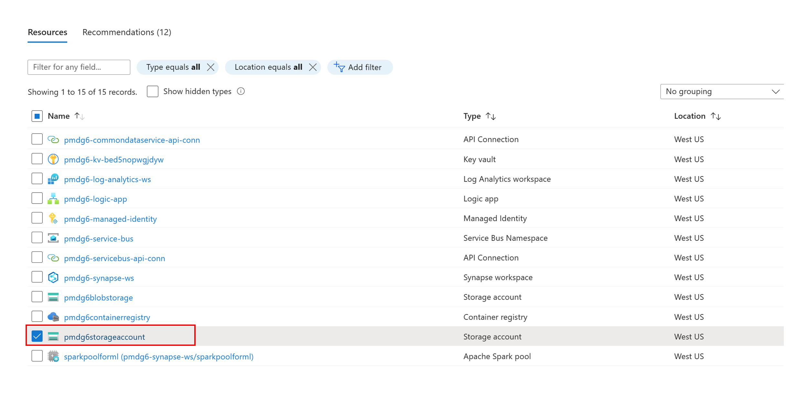

2. Click `Access Control (IAM)` from left pane. Click  `+Add`, then click `Add role assignmen`t.

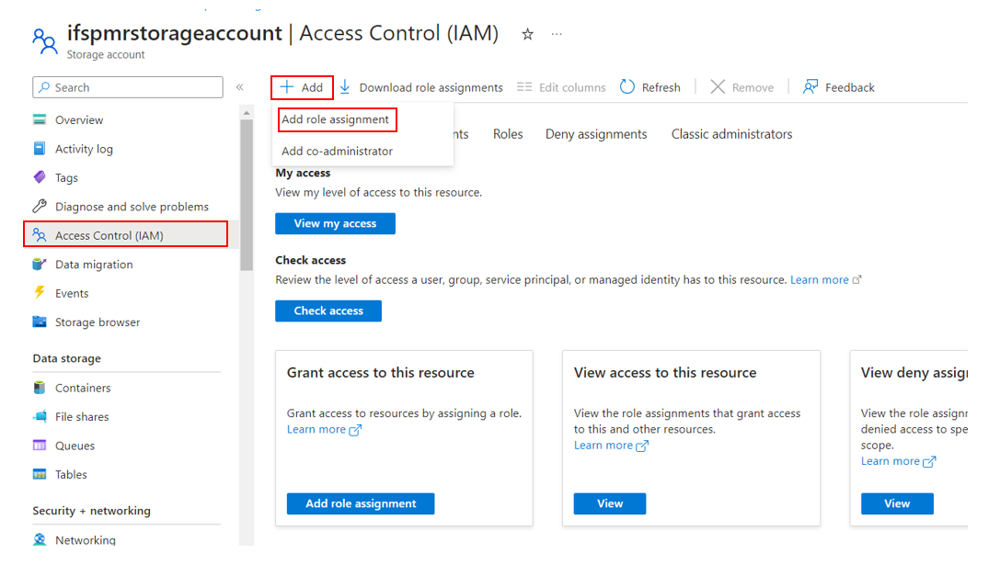

3. Search for `Storage Blob Data Contributor` in the Search box. Select `Storage Blob Data Contributor` from populated result and click `Next`.

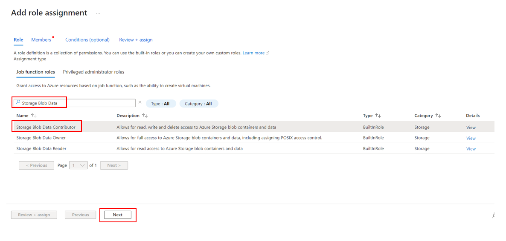

4. Set `Assign access to` option to `User, group, or service principal`.  Click `+Select members`. This will open another window with a list of candidate names, with option to "Search by name or email address". Once the user is found and information displayed, click the user, and then click `Select`. 

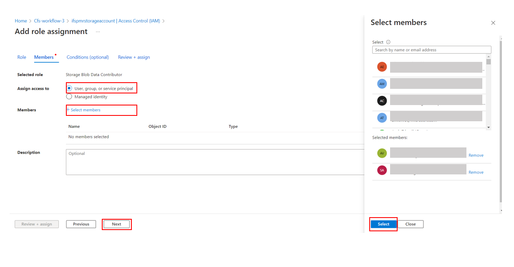

5. Click `Review + assign` to complete the process.

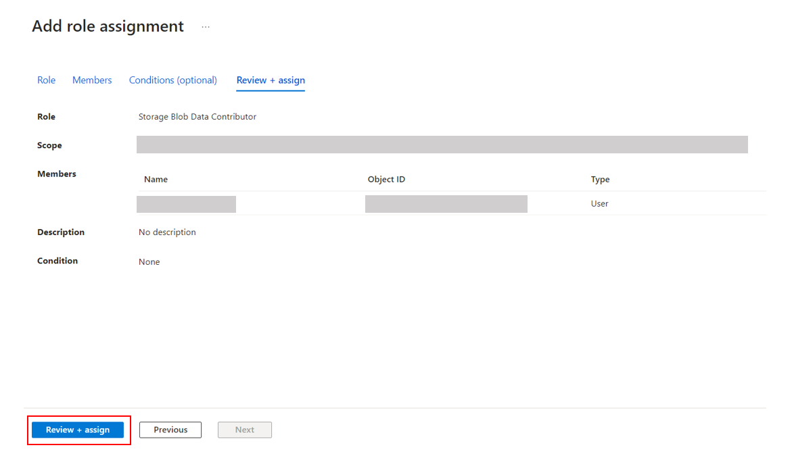

## Create Azure Synapse Link for Dataverse (Skip this if you are using Option 1)

If you need to integrate with your D365 Field Service Dataverse, you will need to set up Azure Synapse Link to pull selected tables from **Dataverse** to Azure Synapse database. You need to have the  **system administrator** security role. Additionally, tables you want to export via Synapse Link must have the **Track changes** property enabled.

For more details, pleases follow this online guide: [Create an Azure Synapse Link for Dataverse with your Azure Synapse Workspace - Power Apps | Microsoft Learn](https://learn.microsoft.com/en-us/power-apps/maker/data-platform/azure-synapse-link-synapse).

Below are the minimal set of tables to be pulled over from Dataverse: 

1. msdyn_customerasset
2. msdyn_iotdevice
3. connection
4. msdyn_iotalert
5. incident
6. msdyn_workorder

## Pipeline Set Up Guide

After completing above steps you can start using the solution by following [Pipeline Set Up Guide](./Pipeline-Setup-Guide.md).

## Clean Up

If you need to delete all the resources you have created, please follow this [Cleanup Guide](./Deployment-Cleanup.md).
