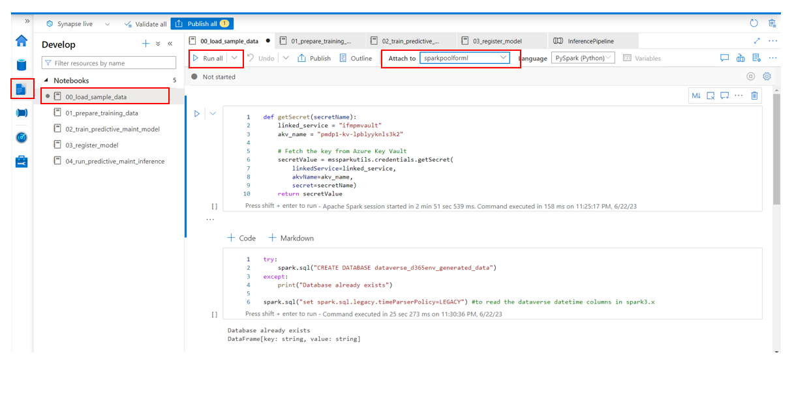
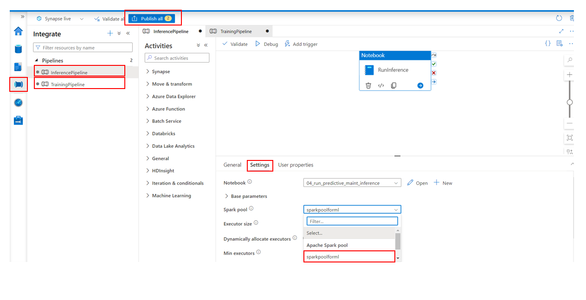
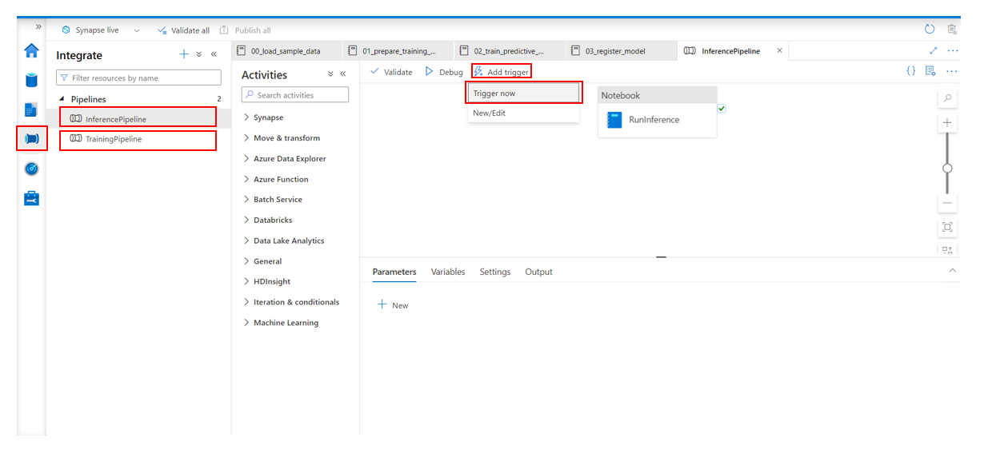
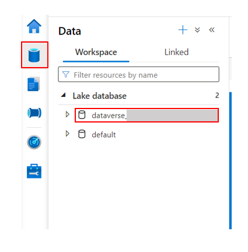
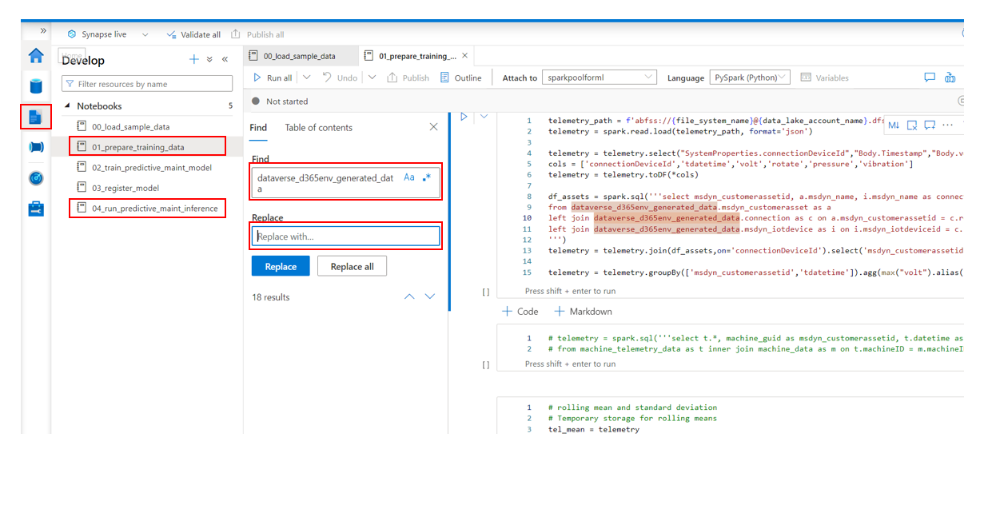

### Option - 1 : Working with sample data provided

1. Open Azure Synapse Studio.
2. Go to Develop tab, open the `00_load_sample_data` notebook. Select the pool from the top toolbar and click Run all.

3. Wait till all cells of the notebook are executed successfully.
4. On left pane, click on integrate icon, then click on `Pipelines.`
5. Open each pipeline and click Settings tab then set the Spark pool as `sparkpoolforml` for all the activities in both pipelines, finally click Publish all from top.

6. **Optional** - Run both pipelines to make sure it has a successful run by clicking on Add Trigger -> Trigger Now.

7. You can schedule the pipeline runs. To schedule the pipelines follow the article here - [Create triggers with UI](https://learn.microsoft.com/en-us/azure/data-factory/concepts-pipeline-execution-triggers#create-triggers-with-ui).

> **_NOTE:_**  – You can schedule the inference pipeline to run on daily basis and the training pipeline to run once a month based on your need.

### Option - 2 : Integrating with Dataverse data

1. Make sure Synapse link is set up.
2. Open Azure Synapse Studio.
3. Go to Data section from left navigation pane and copy the name of Dataverse connection lake database.  

4. Click Develop icon on left pane, then open the notebook `01_prepare_training_data`.   Search and replace `dataverse_d365env_generated_data` with copied name from step above.

5. Do the same for notebook `04_run_predictive_maint_inference`.
6. Publish the changes.
7. Then follow steps 4-7 in the section for option 1.
