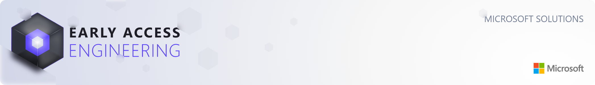
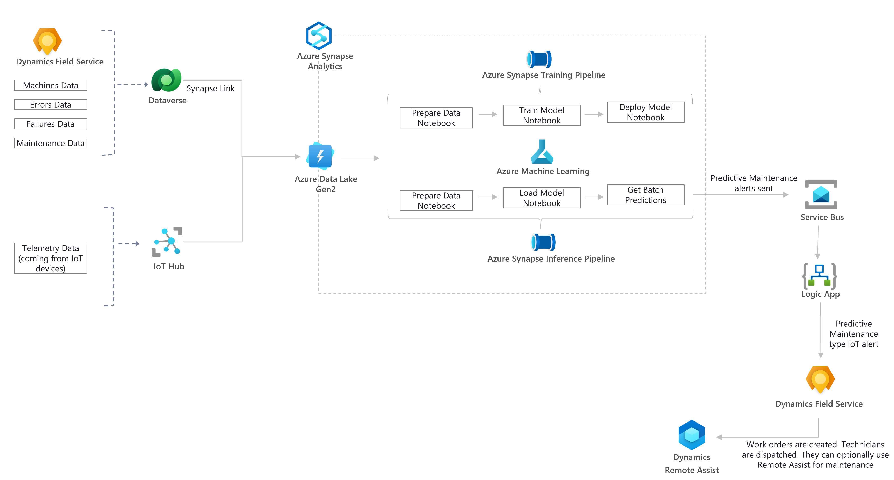
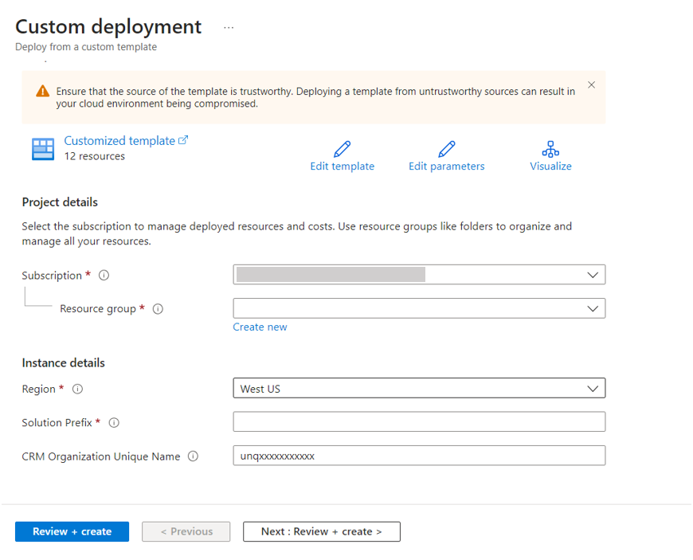

# Predictive Maintenance Solution Overview 

Predictive maintenance (PdM) is a proactive maintenance technique that uses real-time asset data (collected through sensors), historical performance data, data analysis and machine learning algorithms to predict when asset failure might occur. This enables organizations to schedule maintenance at a time that is most convenient, reduce maintenance costs, increase equipment reliability, and reduce downtime.

## Prerequisites

To use this solution accelerator, you will need access to an Azure subscription. Additionally, a prior understanding of Azure Synapse Analytics, Azure Machine Learning, Azure Logic Apps, Azure Service Bus, Dynamic 365 and Dataverse will be helpful.

For additional training and support, please refer to below documents:

1. [Azure Synapse Analytics](https://azure.microsoft.com/en-us/services/synapse-analytics/#overview)
2. [Azure Machine Learning](https://azure.microsoft.com/en-us/services/machine-learning/#product-overview)
3. [Azure Logic Apps](https://azure.microsoft.com/en-us/services/logic-apps/#overview)
4. [Azure Service Bus](https://learn.microsoft.com/en-us/azure/service-bus-messaging/service-bus-messaging-overview)
5. [Dynamics 365](https://dynamics.microsoft.com/en-us/what-is-dynamics365/)
6. [Dataverse](https://learn.microsoft.com/en-us/power-apps/maker/data-platform/data-platform-intro)
7. [Azure Key Vault](https://learn.microsoft.com/en-us/azure/key-vault/general/basic-concepts)

## Architecture

The architecture diagram below details what you will be building for this Solution Accelerator.

## Getting Started

Start by deploying the required resources to Azure. The `Deploy to Azure` button below will help to deploy Azure Synapse Analytics, Azure Machine Learning work space, Spark pool, Azure Service Bus, Azure Logic App and managed identity.  The key vault is used to store the required credentials. The managed identity permission is used to copy sample data, upload notebooks and create Azure Synapse pipelines.

#### Steps:

1. Choose an existing **Azure subscription**.
2. Choose or create a new **resource group** in the selected subscription. If you are planning to use existing resource group then make sure you have **owner** access to it.
3. Set the **region** to the same region as your Dynamics 365 Field Service environment.
4. Solution Prefix: Choose alphanumeric prefix that starts with a letter, for example, '`fspm1`'. The length of the prefix must be smaller or equal to 5. 
5. CRM Organization Unique Name: If you planning to use your own data then enter the **unique name** of your organization. The [Find your environment and organization ID and name - Power Platform | Microsoft Learn](https://learn.microsoft.com/en-us/power-platform/admin/determine-org-id-name#find-your-organization-name) article has steps on how to find this.  
    **OR**  
    You can continue with a dummy CRM Organization Unique Name provided. 
6. **Review + create** the resources from the template.
7. Before proceeding to setting up the solution, ensure the deployment is complete and error free.

## Deployment Guide

After successful deployment of azure resources, please follow steps in [Deployment Guide](../Deployment/Deployment-Guide.md) to set up the solution. 

If you are facing any issues with deployment, please refer to [Deployment Troubleshooting Guide](../Deployment/Deployment-Troubleshooting-Guide.md) for additional guidance. 

